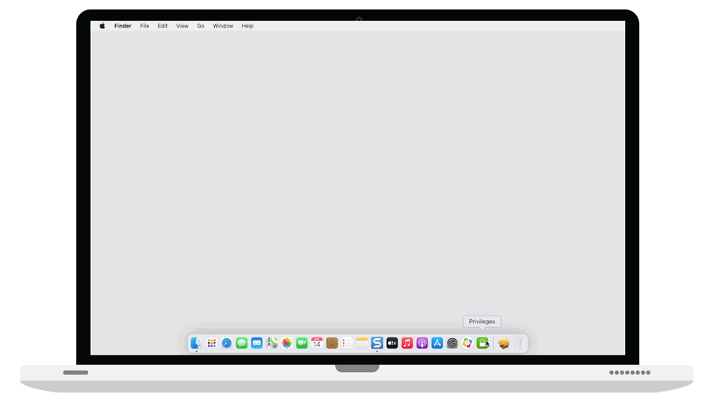

# Privileges

Privileges for macOS is designed to allow users to work as a standard user for day-to-day use, by providing
a quick and easy way to get administrator rights when needed. When you do need admin rights, you can get
them by clicking on the Privileges icon in your Dock.

We believe all users, including all developers, can benefit from using Privileges. Working as a standard user instead of an administrator adds another layer of security to your Mac and is considered a security best
practice. Privileges helps enable users to act as administrators of the system only when required.

**Privileges supports the following macOS versions:**

* macOS 11.x
* macOS 10.15.x
* macOS 10.14.x
* macOS 10.13.x
* macOS 10.12.x

# Features

:hammer_and_wrench: Easy install

:rocket: Perfect for day-to-day use

:alarm_clock: Turn on admin rights anytime

:closed_lock_with_key: Enjoy standard user security

:hourglass: Time limit option available

:fire: Command line use supported

:no_good: No IT department needed

:computer: For macOS 10.12.x and newer

# Application Management
As of Privileges 1.5.0, it is possible to manage settings for Privileges or the PrivilegesCLI command line tool using a macOS configuration profile. [For more details, please click here](https://github.com/SAP/macOS-enterprise-privileges/wiki/Managing-Privileges).

# Articles

We are happy to share with you the article about privileges from 9to5Mac:

[Apple @ Work: Privileges for macOS is the open source tool that all Apple IT departments need](https://9to5mac.com/2019/11/16/privileges-app-for-macos/)

# Demo 

Have a look at how smoothly Privileges can grant you admin rights anytime you need more control over your Mac.

# Documentation

Privileges documentation is available via the wiki or the links below:

* [Installation](https://github.com/SAP/macOS-enterprise-privileges/wiki/Installation)
* [Uninstallation](https://github.com/SAP/macOS-enterprise-privileges/wiki/Uninstallation)
* [Using Privileges](https://github.com/SAP/macOS-enterprise-privileges/wiki/Using-Privileges)
* [Managing Privileges](https://github.com/SAP/macOS-enterprise-privileges/wiki/Managing-Privileges)
* [Frequently Asked Questions](https://github.com/SAP/macOS-enterprise-privileges/wiki/Frequently-Asked-Questions)

# License

Copyright (c) 2018-2021 SAP SE or an SAP affiliate company and macOS-enterprise-privileges contributors. Please see our [LICENSE](LICENSE) for copyright and license information. Detailed information including third-party components and their licensing/copyright information is available [via the REUSE tool](https://api.reuse.software/info/github.com/SAP/macOS-enterprise-privileges).

**SUBCOMPONENTS**

This project references the following Apple `EvenBetterAuthorizationSample` sample code, [which is subject to separate license terms](https://spdx.org/licenses/AML.html). Your use of the code included in this project is subject to the separate license terms applicable to the Apple sample license code.

* Component: 
[Common.h](https://developer.apple.com/library/archive/samplecode/EvenBetterAuthorizationSample/Listings/Common_Common_h.html#//apple_ref/doc/uid/DTS40013768-Common_Common_h-DontLinkElementID_12/)
* Component: 
[Common.m](https://developer.apple.com/library/archive/samplecode/EvenBetterAuthorizationSample/Listings/Common_Common_m.html#//apple_ref/doc/uid/DTS40013768-Common_Common_m-DontLinkElementID_13/)
* Component: 
[HelperTool.h](https://developer.apple.com/library/archive/samplecode/EvenBetterAuthorizationSample/Listings/HelperTool_HelperTool_h.html#//apple_ref/doc/uid/DTS40013768-HelperTool_HelperTool_h-DontLinkElementID_14/)
* Component: 
[HelperTool.m](https://developer.apple.com/library/archive/samplecode/EvenBetterAuthorizationSample/Listings/HelperTool_HelperTool_m.html#//apple_ref/doc/uid/DTS40013768-HelperTool_HelperTool_m-DontLinkElementID_15/)

For more details, please see the the [License file](https://github.com/SAP/macOS-enterprise-privileges/blob/main/LICENSE). The Apple `EvenBetterAuthorizationSample` sample code is also available for review in the `reference_source` directory.

# Security

Found a security-related issue or vulnerability and want to notify us?

Please contact us at:
[privileges-security@sap.com](mailto:privileges-security@sap.com?subject=[GitHub]%20Source%20Han%20Sans)

# Support

This project is 'as-is' with no support, no changes being made. You are welcome to make changes to improve it but we are not available for questions or support of any kind.