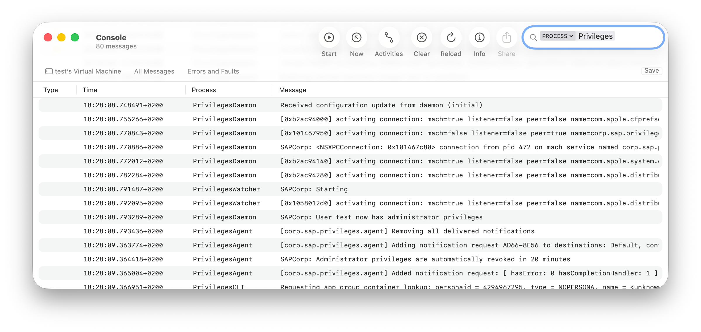
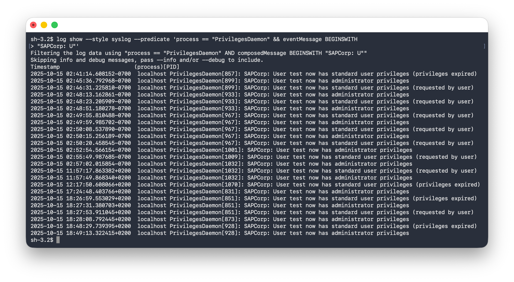

# Privileges.app

Description 
===================================

**Privileges.app** for macOS is designed to allow users to work as a standard user for day-to-day use, by providing a quick and easy way to get administrator rights when needed. When you do need admin rights, you can get them by clicking on the **Privileges** icon in your Dock.

We believe all users, including all developers, can benefit from using **Privileges.app**. Working as a standard user instead of an administrator adds another layer of security to your Mac and is considered a security best practice. **Privileges.app** helps enable users to act as administrators of the system only when required.

Requirements
===================================

**Privileges** supports the following macOS versions:

* macOS 10.12.x
* macOS 10.13.x
* macOS 10.14.x
* macOS 10.15.x
* macOS 11.x

Installation
===================================

1. Log into your Mac using an account with admin privileges

2. Download **Privileges.app**.

3. Copy **Privileges.app** to to the Applications folder on your Mac.
<br>
<br>


<br>

4. Launch **Privileges.app** and click the `Remove Privileges` button.

<br>

5. Install the helper tool when prompted.

<p></p>


<p></p>
<p></p>
The logged-in account should now be a standard user account.
<p></p>


**Note:** To use all of **Privileges.app**'s functions, we recommend adding **Privileges.app** to the dock.
<p></p>


<p></p>

Using Privileges.app
===================================

If you are a standard user and want admin rights, verify that **Privileges.app** is installed then use the following procedure:

1. Launch **Privileges.app** 
2. Click the `Request Privileges` button.
3. The **Privileges** dock icon should change to look like a yellow unlocked padlock.
4. A **Privileges have been changed successfully** message should appear.
<p></p>


<p></p>
5. The logged-in account should now have admin rights.
<p></p>


<p></p>


If you are a admin user and want to remove admin rights, verify that **Privileges.app** is installed then use the following procedure:

1. Launch **Privileges.app**.
2. Click the `Remove Privileges` button.
3. The **Privileges** dock icon should change to look like a green locked padlock.
4. A **Privileges have been changed successfully** message should appear.
<p></p>


<p></p> 
5. The logged-in account should now be a standard user account.
<p></p>


<p></p>


Helper Tools
===================================

The following helper tools are installed to allow **Privileges.app** the necessary access rights to grant or remove admin rights:

`/Library/PrivilegedHelperTools/corp.sap.privileges.helper`

<br>


<br>

`/Library/LaunchDaemons/corp.sap.privileges.helper.plist`

<br>


<br>

For more information on privilege elevation using a privileged helper app and LaunchDaemon, please see the link below:

[https://developer.apple.com/library/archive/documentation/Security/Conceptual/SecureCodingGuide/Articles/AccessControl.html](https://developer.apple.com/library/archive/documentation/Security/Conceptual/SecureCodingGuide/Articles/AccessControl.html)


Frequently Asked Questions
===================================


### Why does the icon for Privileges.app change colors in the Dock?

This is by design. The icon is green and displays a locked padlock icon when you are a standard user. 

<br>

Dock icon for macOS Catalina and earlier:


<br>

Dock icon for macOS Big Sur:


<br>

The icon is yellow and displays an unlocked padlock icon when you are an administrator.

<br>

Dock icon for macOS Catalina and earlier:


<br>

Dock icon for macOS Big Sur:


<br>

### By default, is there a time limit on the admin rights granted by Privileges.app?

No. Admin rights are granted until some process (like running **Privileges.app** again) takes them away.

### Can I set Privileges.app to give me administrator rights for a defined amount of time?

Yes. You can use the **Toggle Privileges** option on the dock icon to get admin rights for a set amount of time (the default amount is 20 minutes.)

<br>


<br>

<br>


<br>

To set the amount of time used by the **Toggle Privileges** option, use the following procedure:

1. Launch **Privileges.app**
2. Click on the **Privileges** menu and select **Preferences**
3. Select the desired amount of time from the available options.
<p></p>


### What actions do the Lock Screen and Login Window toggle options perform?

The **Lock Screen** toggle option locks your screen.

<br>


<br>

The **Login Window** toggle option returns you to the Login Window without logging you out.

<br>


<br>


### How do I use Privileges.app in a script or from the command line?

**Privileges.app** supports command line use. To use the **PrivilegesCLI** command line tool, run `/Applications/Privileges.app/Contents/Resources/PrivilegesCLI` followed by the option you want to use.

The **PrivilegesCLI** command line tool currently supports the following options:

* `/Applications/Privileges.app/Contents/Resources/PrivilegesCLI --add` : Adds the logged-in user to the admin group.
<p></p>


<p></p> 

* `/Applications/Privileges.app/Contents/Resources/PrivilegesCLI --remove` : Removes the logged-in user from the admin group.

<p></p>


<p></p> 

<p></p> 

* `/Applications/Privileges.app/Contents/Resources/PrivilegesCLI --status` : Displays the current user's privileges.

<p></p>


<p></p> 


For assistance, please run the following command to display all available options:

`/Applications/Privileges.app/Contents/Resources/PrivilegesCLI`


### How do I access logs for Privileges.app?

**Privileges.app** uses the system log for logging. To see all logs for **Privileges.app** in the **Console** app, you can filter for the `corp.sap.privileges.helper` process.



To see only the logging associated with changing admin rights in the **Console** app, you can filter for log messages containing `SAPCorp`.


To access the same logs from the command line, the `log` command can be used. To see all logs for **Privileges.app** using the `log` command, the following command can be used:

```
log show --style syslog --predicate 'process == "corp.sap.privileges.helper"'
```


To see only the logging associated with changing admin rights, the following command can be used:

```
log show --style syslog --predicate 'process == "corp.sap.privileges.helper" && eventMessage CONTAINS "SAPCorp"'
```




### How do I uninstall Privileges.app?

1. Ensure that your user account has admin rights. If needed, launch **Privileges.app** one final time to make sure you have them.
2. Remove the following files:

* `/Applications/Privileges.app`

<p></p>


<p></p>

* `/Library/PrivilegedHelperTools/corp.sap.privileges.helper`

<p></p>


<p></p>

* `/Library/LaunchDaemons/corp.sap.privileges.helper.plist`
<p></p>


<p></p>


Application Management
===================================

As of Privileges 1.5.0, it is possible to manage settings for **Privileges.app** or the **PrivilegesCLI** command line tool using a macOS configuration profile. [For more details, please click here](application_management).


Support
===================================
This project is 'as-is' with no support, no changes being made.  You are welcome to make changes to improve it but we are not available for questions or support of any kind.

Security
===================================
 Found a security-related issue or vulnerability and want to notify us? Please contact us at [privileges-security@sap.com](mailto:privileges-security@sap.com)

License
===================================
Copyright (c) 2020 SAP SE or an SAP affiliate company.  All rights reserved. 
This file is licensed under the Apache Software License, Version 2.0 except as noted in the [LICENSE](LICENSE) file. 

SUBCOMPONENTS

This project includes the following Apple `EvenBetterAuthorizationSample` sample code, which is subject to separate license terms.
Your use of the code included in this project is subject to the separate license terms applicable to
the Apple sample license code.

* Component: [Common.h](https://developer.apple.com/library/archive/samplecode/EvenBetterAuthorizationSample/Listings/Common_Common_h.html#//apple_ref/doc/uid/DTS40013768-Common_Common_h-DontLinkElementID_12) 
* Component: [Common.m](https://developer.apple.com/library/archive/samplecode/EvenBetterAuthorizationSample/Listings/Common_Common_m.html#//apple_ref/doc/uid/DTS40013768-Common_Common_m-DontLinkElementID_13)
* Component: [HelperTool.h](https://developer.apple.com/library/archive/samplecode/EvenBetterAuthorizationSample/Listings/HelperTool_HelperTool_h.html#//apple_ref/doc/uid/DTS40013768-HelperTool_HelperTool_h-DontLinkElementID_14) 
* Component: [HelperTool.m](https://developer.apple.com/library/archive/samplecode/EvenBetterAuthorizationSample/Listings/HelperTool_HelperTool_m.html#//apple_ref/doc/uid/DTS40013768-HelperTool_HelperTool_m-DontLinkElementID_15)

For more details, please see the the [LICENSE](LICENSE) file. 
